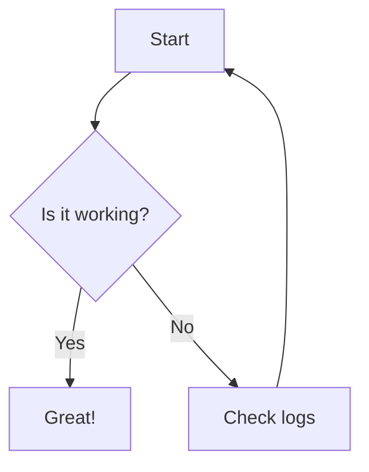
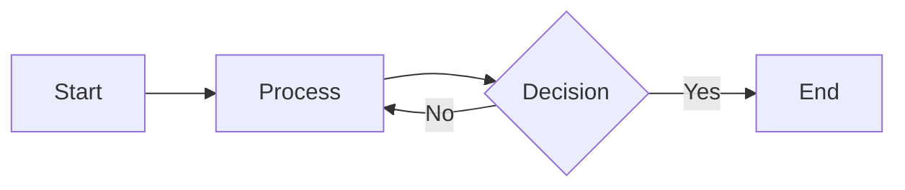
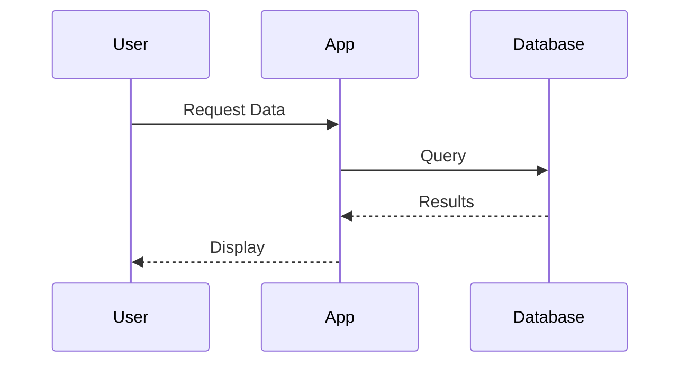
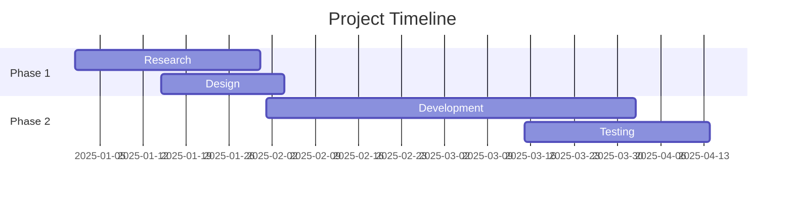

# Mermaid Diagram Support - Setup Guide

## Overview

The GerdsenAI Document Builder now supports **Mermaid diagram rendering** in Markdown documents! Mermaid diagrams are automatically detected and rendered as high-quality images in your PDF documents.

## Features

✅ **Local Rendering** - Uses Playwright + Chromium (no internet required after setup)  
✅ **Fast Performance** - ~0.5 seconds per diagram  
✅ **High Quality** - Configurable viewport and themes  
✅ **Automatic Fallback** - Shows as code block if rendering fails  
✅ **Zero Configuration** - Works out of the box with sensible defaults  
✅ **Backward Compatible** - Regular code blocks work exactly as before  

---

## Installation

### 1. Install Dependencies

```bash
# Install Python packages
pip install -r requirements.txt

# Install Chromium browser (one-time, ~200MB download)
playwright install chromium
```

### 2. Verify Installation

```bash
# Test that mermaid-cli is installed
python -c "from mermaid_cli import render_mermaid_file_sync; print('✓ mermaid-cli ready')"
```

That's it! You're ready to use Mermaid diagrams.

---

## Usage

### Basic Example

In your Markdown file, create a Mermaid diagram using fenced code blocks with the `mermaid` language identifier:

````markdown
# My Document

Here's a flowchart:



Regular code still works:

```python
print("Hello, World!")
```
````

### Supported Diagram Types

Mermaid supports many diagram types:

- **Flowcharts** - `flowchart TD` or `graph TD`
- **Sequence Diagrams** - `sequenceDiagram`
- **Gantt Charts** - `gantt`
- **Class Diagrams** - `classDiagram`
- **State Diagrams** - `stateDiagram-v2`
- **Entity Relationship** - `erDiagram`
- **User Journey** - `journey`
- **Pie Charts** - `pie`
- And more!

See the [Mermaid documentation](https://mermaid.js.org/) for full syntax.

---

## Configuration

Edit `config.yaml` to customize Mermaid rendering:

```yaml
mermaid:
  enabled: true  # Enable/disable Mermaid rendering
  
  # Rendering settings
  theme: default  # Options: default, dark, forest, neutral, base
  background: white  # white, transparent, or hex color (#ffffff)
  
  # Viewport (affects quality and detail)
  viewport_width: 1200
  viewport_height: 800
  
  # PDF sizing
  max_width_percent: 95  # Percentage of page width
  
  # Error handling
  fallback_to_code: true  # Show as code block if rendering fails
  
  # Advanced
  flow_curve: basis  # Options: basis, linear, cardinal
  sequence_diagram_actors: true
```

### Configuration Options Explained

| Option | Default | Description |
|--------|---------|-------------|
| `enabled` | `true` | Master switch to enable/disable Mermaid |
| `theme` | `default` | Visual theme (default, dark, forest, neutral, base) |
| `background` | `white` | Background color (white, transparent, or hex) |
| `viewport_width` | `1200` | Rendering viewport width in pixels |
| `viewport_height` | `800` | Rendering viewport height in pixels |
| `max_width_percent` | `95` | Maximum width as % of page width (after margins) |
| `fallback_to_code` | `true` | Show as code block if rendering fails |
| `flow_curve` | `basis` | Flowchart line style (basis, linear, cardinal) |

---

## Testing

Test with the included example file:

```bash
# Build the TabX Figma Flow document (contains 20 Mermaid diagrams)
python document_builder_reportlab.py TabX_Figma_Flow.md

# Check the output in PDFs/ directory
```

The `TabX_Figma_Flow.md` file contains 20 different Mermaid diagrams showcasing various diagram types and styling options.

---

## How It Works

### Detection

The system detects Mermaid diagrams by looking for:

```markdown
```mermaid
... diagram code ...
```
```

The Markdown library converts this to HTML with a `class="language-mermaid"` attribute, which the builder detects.

### Rendering Process

1. **Extract** - Mermaid code is extracted from the code block
2. **Save** - Code is saved to a temporary `.mmd` file
3. **Render** - Playwright launches Chromium and renders the diagram to PNG
4. **Scale** - Image is scaled to fit the PDF page width
5. **Insert** - PNG is inserted into the PDF as an image
6. **Cleanup** - Temporary files are deleted

### Fallback Behavior

If rendering fails (e.g., invalid syntax, Chromium not installed):

1. Error is logged to `Logs/document_builder_YYYYMMDD.log`
2. Diagram is displayed as a regular code block
3. PDF generation continues without interruption

---

## Troubleshooting

### Issue: "mermaid-cli not installed"

**Solution:**
```bash
pip install mermaid-cli
```

### Issue: "Playwright not installed"

**Solution:**
```bash
pip install playwright
playwright install chromium
```

### Issue: Diagrams render but look poor quality

**Solution:** Increase viewport size in `config.yaml`:
```yaml
mermaid:
  viewport_width: 1600  # Higher = better quality
  viewport_height: 1200
```

### Issue: Diagrams are too large in PDF

**Solution:** Reduce max width percentage in `config.yaml`:
```yaml
mermaid:
  max_width_percent: 80  # Lower = smaller diagrams
```

### Issue: Invalid Mermaid syntax

**Solution:** Validate your Mermaid code at https://mermaid.live before adding to your document.

### Issue: Chromium crashes or fails

**Solution:** 
```bash
# Reinstall Chromium
playwright install chromium --force
```

---

## Advanced Usage

### Custom Themes

Use different themes for different documents by adding Mermaid config in the Markdown front matter:

```markdown
---
title: My Document
mermaid:
  theme: dark
  background: transparent
---

# Content here...
```

### Disable for Specific Documents

Disable Mermaid rendering for a specific build:

```yaml
# In config.yaml
mermaid:
  enabled: false  # Temporarily disable
```

Or use a separate config file:

```bash
# Create config_no_mermaid.yaml
python document_builder_reportlab.py myfile.md --config config_no_mermaid.yaml
```

---

## Performance

### Rendering Speed

- **First diagram**: ~2-3 seconds (Chromium startup)
- **Subsequent diagrams**: ~0.5 seconds each
- **Total overhead**: ~1-2 seconds + (0.5s × number of diagrams)

### Example Timings

| Document | Diagrams | Total Time |
|----------|----------|------------|
| Simple | 1 | ~3 seconds |
| Medium | 5 | ~5 seconds |
| TabX Flow | 20 | ~12 seconds |
| Large | 50 | ~27 seconds |

### Optimization Tips

1. **Simplify diagrams** - Fewer nodes = faster rendering
2. **Use caching** - Diagrams are rendered each time (no caching yet)
3. **Batch processing** - Build multiple documents in one run

---

## Privacy & Security

✅ **100% Local** - All rendering happens on your machine  
✅ **No External Calls** - No data sent to external services  
✅ **Offline Support** - Works without internet connection  
✅ **No Telemetry** - No usage tracking or analytics  

Unlike API-based solutions (mermaid.ink), your diagram code **never leaves your computer**.

---

## Examples

### Example 1: Simple Flowchart



### Example 2: Sequence Diagram



### Example 3: Gantt Chart



---

## Comparison: API vs Local Rendering

| Feature | API (mermaid.ink) | Local (mermaid-cli) |
|---------|-------------------|---------------------|
| **Internet Required** | ✅ Yes | ❌ No |
| **Privacy** | ⚠️ Code sent externally | ✅ 100% local |
| **Speed** | ~1-2s per diagram | ~0.5s per diagram |
| **Reliability** | Depends on service | ✅ Always available |
| **Setup** | None | One-time (~200MB) |
| **Quality** | Good | Excellent |
| **Offline Support** | ❌ No | ✅ Yes |

**Recommendation:** Local rendering (mermaid-cli) is superior in every way except initial setup.

---

## Migration Guide

### From Other Markdown → PDF Tools

If you're migrating from another tool (Pandoc, mdpdf, etc.):

1. **No changes needed** - Standard Mermaid syntax works
2. **Copy diagrams** - Paste directly into your Markdown
3. **Configure once** - Set your preferred theme in `config.yaml`
4. **Build** - Run the document builder

### From Manual Diagram Creation

If you were manually creating diagrams (draw.io, etc.):

1. **Convert to Mermaid** - Use mermaid.live to create diagrams
2. **Copy code** - Paste into your Markdown with ` ```mermaid ` fence
3. **Remove images** - Delete old PNG/SVG files
4. **Version control** - Diagram code is now text (Git-friendly!)

---

## Limitations

### Known Limitations

1. **No SVG output** - Currently only PNG (SVG support planned)
2. **No diagram caching** - Each build re-renders diagrams
3. **No interactive elements** - Static images only (PDF limitation)
4. **Theme per document** - Cannot have different themes per diagram
5. **Large diagrams** - Very complex diagrams may exceed page size

### Workarounds

For **very large diagrams**:
```yaml
mermaid:
  viewport_width: 2400  # Double resolution
  max_width_percent: 100  # Use full page width
```

For **different themes**:
- Build separate PDFs with different config files
- Use separate documents for different themes

---

## Support

### Getting Help

1. **Check logs**: `Logs/document_builder_YYYYMMDD.log`
2. **Test syntax**: https://mermaid.live
3. **Verify install**: `playwright install chromium`
4. **Read docs**: https://mermaid.js.org/

### Reporting Issues

When reporting issues, include:

- Python version (`python --version`)
- Error message from logs
- Mermaid code that failed
- Operating system

---

## Future Enhancements

Planned features:

- [ ] SVG output support
- [ ] Diagram caching for faster rebuilds
- [ ] Per-diagram theme override
- [ ] Interactive PDF elements (if possible)
- [ ] Auto-scaling for oversized diagrams
- [ ] Diagram library/templates
- [ ] Custom CSS styling

---

## Credits

- **Mermaid.js**: https://mermaid.js.org/
- **mermaid-cli**: https://github.com/seigok/mermaid-cli-python
- **Playwright**: https://playwright.dev/

---

**Version**: 1.0.0  
**Last Updated**: October 20, 2025  
**Status**: Production Ready ✅
