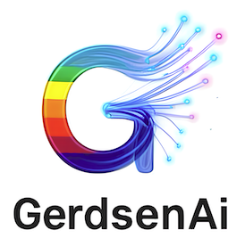

# GerdsenAI Document Builder

A professional document builder that converts Markdown and text files into stunning, professional PDFs with custom styling, terminal-themed code blocks, and intelligent text formatting.



## Features

### Professional Design
- **Custom Cover Pages** with logo, title, author, and metadata
- **SF Pro Font Support** for Apple-style typography (falls back to Helvetica if unavailable)
- **1-inch Margins** on all sides for professional printing
- **Page Numbers & Headers** on all pages except cover
- **Logo in Footer** for brand consistency

### Terminal-Style Code Formatting
- **Code Blocks**: Black background with bright green text (#00ff00) for authentic terminal appearance
- **Inline Code**: Bright green (#00c853) Courier-Bold font for visibility
- **Syntax Preservation**: Proper escaping of special characters
- **Multi-line Support**: Handles triple-backtick (```) markdown code blocks

### Intelligent Text Formatting
- **Smart Justification**: Automatically switches between justified and left-aligned text based on content
- **Dynamic Alignment Rules**:
  - Paragraphs with 2+ inline code snippets → Left aligned (prevents spacing issues)
  - Short paragraphs (<150 characters) → Left aligned
  - Long narrative text → Justified for professional appearance
- **Word Wrapping**: Proper handling of long technical terms
- **Hyphenation Support**: For better text distribution

### Technical Features
- **Markdown Support**: Full markdown parsing with extensions (tables, footnotes, etc.)
- **Metadata Extraction**: YAML front matter support for document metadata
- **Table Formatting**: Professional table styling with alternating row colors
- **Blockquote Styling**: Distinctive formatting with blue accent border
- **Multiple Document Processing**: Build single or multiple documents at once
- **Configurable Filename Prefix**: Add custom prefixes to generated PDFs (default: `GerdsenAI_`)

## Installation and Setup

### Prerequisites

**All Platforms:**
- Python 3.9 or higher
- Git (for cloning the repository)

**Platform-specific:**
- **macOS**: Homebrew (optional, for additional fonts)
- **Windows**: Windows 10/11 or Windows Subsystem for Linux (WSL)
- **Linux**: Standard package manager (apt, yum, pacman, etc.)

### Clone Repository

```bash
git clone https://github.com/GerdsenAI/GerdsenAI_Document_Builder.git
cd GerdsenAI_Document_Builder
```

### Setup Instructions by Platform

#### macOS Setup

1. **Ensure Python 3.9+ is installed:**
   ```bash
   python3 --version
   ```
   If not installed, download from [python.org](https://python.org) or use Homebrew:
   ```bash
   brew install python@3.11
   ```

2. **Create and activate virtual environment:**
   ```bash
   python3 -m venv venv
   source venv/bin/activate
   ```

3. **Install dependencies:**
   ```bash
   pip install -r requirements.txt
   ```

4. **Make build script executable:**
   ```bash
   chmod +x build_document.sh
   ```

#### Windows Setup

1. **Ensure Python 3.9+ is installed:**
   ```cmd
   python --version
   ```
   If not installed, download from [python.org](https://python.org) and ensure "Add to PATH" is checked.

2. **Create and activate virtual environment:**
   ```cmd
   python -m venv venv
   venv\Scripts\activate
   ```

3. **Install dependencies:**
   ```cmd
   pip install -r requirements.txt
   ```

4. **Build documents using Python directly:**
   ```cmd
   python document_builder_reportlab.py --help
   ```

#### Linux Setup

1. **Ensure Python 3.9+ is installed:**
   ```bash
   python3 --version
   ```
   
   **Ubuntu/Debian:**
   ```bash
   sudo apt update
   sudo apt install python3 python3-pip python3-venv
   ```
   
   **CentOS/RHEL/Fedora:**
   ```bash
   sudo yum install python3 python3-pip  # CentOS/RHEL
   sudo dnf install python3 python3-pip  # Fedora
   ```
   
   **Arch Linux:**
   ```bash
   sudo pacman -S python python-pip
   ```

2. **Create and activate virtual environment:**
   ```bash
   python3 -m venv venv
   source venv/bin/activate
   ```

3. **Install dependencies:**
   ```bash
   pip install -r requirements.txt
   ```

4. **Make build script executable:**
   ```bash
   chmod +x build_document.sh
   ```

#### Windows Subsystem for Linux (WSL) Setup

1. **Install WSL2 and Ubuntu:**
   ```powershell
   wsl --install
   ```

2. **Open WSL terminal and follow Linux setup instructions above**

3. **Access Windows files from WSL:**
   ```bash
   cd /mnt/c/Users/YourUsername/path/to/project
   ```

### VSCode Setup

#### Installation
1. **Install VSCode:** Download from [code.visualstudio.com](https://code.visualstudio.com)

2. **Install Python extension:**
   - Open VSCode
   - Go to Extensions (Ctrl+Shift+X / Cmd+Shift+X)
   - Search for "Python" by Microsoft
   - Click Install

#### Configure Python Interpreter

1. **Open project in VSCode:**
   ```bash
   code .
   ```

2. **Select Python interpreter:**
   - Press `Ctrl+Shift+P` (Windows/Linux) or `Cmd+Shift+P` (macOS)
   - Type "Python: Select Interpreter"
   - Choose the interpreter from your virtual environment:
     - **macOS/Linux**: `./venv/bin/python`
     - **Windows**: `.\venv\Scripts\python.exe`

3. **Verify setup:**
   - Open a Python file (e.g., `document_builder_reportlab.py`)
   - Check bottom-left corner shows correct Python version and virtual environment

#### VSCode Settings (Optional)

Create `.vscode/settings.json` for consistent project settings:

```json
{
    "python.defaultInterpreterPath": "./venv/bin/python",
    "python.terminal.activateEnvironment": true,
    "python.linting.enabled": true,
    "python.linting.pylintEnabled": true,
    "files.associations": {
        "*.md": "markdown"
    }
}
```

## Repository Structure

```
GerdsenAI_Document_Builder/
├── To_Build/              # Place your .md or .txt files here
├── PDFs/                  # Generated PDFs are saved here
├── Assets/                # Logo and cover images
│   └── GerdsenAI_Neural_G_Invoice.png
├── SF Pro/                # SF Pro font files (optional)
│   ├── SF-Pro-Rounded-Regular.otf
│   ├── SF-Pro-Rounded-Bold.otf
│   └── ...
├── .vscode/               # VSCode configuration (auto-created)
│   └── settings.json
├── venv/                  # Virtual environment (auto-created)
├── document_builder_reportlab.py  # Main document builder
├── build_document.sh      # Shell script for easy building (macOS/Linux)
├── config.yaml           # Default configuration
├── requirements.txt      # Python dependencies
├── LICENSE.txt           # MIT License
└── README.md            # This file
```

## Usage

### Building Documents

#### Using Build Script (macOS/Linux)

1. **Place your markdown files** in the `To_Build` folder

2. **Activate virtual environment:**
   ```bash
   source venv/bin/activate
   ```

3. **Build specific document:**
   ```bash
   ./build_document.sh your_document.md
   ```

4. **Build all documents:**
   ```bash
   ./build_document.sh --all
   ```

5. **Setup environment:**
   ```bash
   ./build_document.sh --setup
   ```

6. **Clean PDFs:**
   ```bash
   ./build_document.sh --clean
   ```

7. **Show help:**
   ```bash
   ./build_document.sh --help
   ```

#### Using Python Directly (All Platforms)

1. **Activate virtual environment:**
   
   **macOS/Linux:**
   ```bash
   source venv/bin/activate
   ```
   
   **Windows:**
   ```cmd
   venv\Scripts\activate
   ```

2. **Build documents:**
   ```bash
   python document_builder_reportlab.py --help
   python document_builder_reportlab.py input_file.md
   python document_builder_reportlab.py --all
   ```

### Document Format

#### Markdown with YAML Front Matter
```markdown
---
title: Your Document Title
author: Your Name
date: August 22, 2025
version: 1.0.0
---

# Introduction

Your content here with **bold**, *italic*, and `inline code`.

## Code Example

```python
def hello_world():
    print("Hello, World!")
```

## Features

- Bullet points
- With smart formatting
- And proper spacing
```

### Configuration

Edit `config.yaml` to customize default settings:

```yaml
default:
  author: "Your Name"
  company: "Your Company"
  version: "1.0.0"
  filename_prefix: "GerdsenAI_"  # Prefix for generated PDFs

margins:
  top: 25      # mm
  right: 20    # mm
  bottom: 25   # mm
  left: 20     # mm
```

#### Filename Prefix
The `filename_prefix` setting adds a custom prefix to all generated PDFs:
- Default: `GerdsenAI_`
- Example output: `GerdsenAI_document_20250822_123456.pdf`
- Set to empty string (`""`) to disable prefix

## Styling Features

### Code Blocks
- **Terminal Theme**: Black background (#000000) with bright green text (#00ff00)
- **Border**: Dark gray (#333333) for definition
- **Padding**: 8pt for comfortable reading
- **Font**: Courier monospace for authenticity

### Inline Code
- **Color**: Bright green (#00c853)
- **Font**: Courier-Bold for emphasis
- **Size**: 10pt for visibility

### Text Alignment Logic
The document builder intelligently decides text alignment:

| Content Type | Alignment | Reason |
|-------------|-----------|--------|
| Long paragraphs (>150 chars) | Justified | Professional appearance |
| Short paragraphs (<150 chars) | Left | Prevents excessive spacing |
| Paragraphs with 2+ code snippets | Left | Avoids justification gaps |
| Headers | Left | Standard formatting |
| Code blocks | Left | Preserves formatting |

## Advanced Features

### Custom Fonts
The builder supports SF Pro fonts but falls back gracefully to system fonts:
1. **Primary**: SF Pro Rounded (if available)
2. **Fallback**: Helvetica, Arial, sans-serif

### Metadata Support
Documents can include metadata in YAML front matter:
- `title`: Document title (shown on cover and headers)
- `author`: Author name
- `date`: Publication date
- `version`: Document version
- `subtitle`: Optional subtitle for cover page

### Page Layout
- **Cover Page**: Automatically generated with logo and metadata
- **Headers**: Document title on all pages except cover
- **Footers**: Page numbers and centered logo
- **Margins**: 1 inch on all sides for professional printing

## Troubleshooting

### Common Issues

#### Virtual Environment Not Activating

**macOS/Linux:**
```bash
# Ensure venv exists
python3 -m venv venv
source venv/bin/activate
```

**Windows:**
```cmd
# Ensure venv exists
python -m venv venv
venv\Scripts\activate
```

#### Font Warnings
If you see warnings about SF Pro fonts:
- These are optional - the document will still build correctly
- Uses Helvetica as fallback
- To use SF Pro, ensure .otf files are in the SF Pro directory

#### Permission Issues (macOS/Linux)
```bash
chmod +x build_document.sh
```

#### Missing Dependencies
```bash
# Activate venv first
source venv/bin/activate  # macOS/Linux
# OR
venv\Scripts\activate     # Windows

# Then reinstall
pip install -r requirements.txt
```

#### VSCode Python Interpreter Issues
1. Press `Ctrl+Shift+P` / `Cmd+Shift+P`
2. Type "Python: Select Interpreter"
3. Choose the virtual environment Python
4. Restart VSCode if needed

#### Windows Path Issues
If you encounter path-related errors on Windows:
- Use forward slashes `/` in paths when possible
- Ensure virtual environment is activated
- Use `python` instead of `python3` on Windows

## Dependencies and Credits

This project is built with the following excellent open-source packages:

### Core Dependencies
- **[ReportLab](https://www.reportlab.com/)** (>=4.0.0) - Powerful PDF generation library
  - License: BSD-style license
  - Used for: PDF creation, styling, and layout management

- **[Python-Markdown](https://python-markdown.github.io/)** (>=3.5.0) - Markdown to HTML converter
  - License: BSD License
  - Used for: Converting Markdown syntax to HTML for processing

- **[Beautiful Soup 4](https://www.crummy.com/software/BeautifulSoup/)** (>=4.12.0) - HTML/XML parser
  - License: MIT License
  - Used for: HTML parsing and manipulation

- **[Pillow](https://pillow.readthedocs.io/)** (>=10.0.0) - Python Imaging Library
  - License: HPND License
  - Used for: Image processing and manipulation

- **[PyYAML](https://pyyaml.org/)** (>=6.0) - YAML parser and emitter
  - License: MIT License
  - Used for: Configuration file parsing and YAML front matter

### Optional Dependencies
- **[Watchdog](https://github.com/gorakhargosh/watchdog)** (>=3.0.0) - File system monitoring
  - License: Apache License 2.0
  - Used for: Automatic rebuilding on file changes

- **[PyMdown Extensions](https://facelessuser.github.io/pymdown-extensions/)** (>=10.0) - Markdown extensions
  - License: MIT License
  - Used for: Enhanced Markdown features (tables, code blocks, etc.)

### System Requirements
- **Python 3.9+** - Programming language runtime
- **Git** - Version control system for cloning repository

### Font Credits
- **SF Pro** - Apple's system font family (optional)
  - Used with permission for enhanced typography
  - Falls back to system fonts (Helvetica, Arial) if unavailable

### Development Tools
- **VSCode** - Recommended IDE with Python extension
- **Pylance** - Python language server for VSCode

## Performance Notes

### Build Times
- Single document: ~1-3 seconds
- Multiple documents: ~2-5 seconds per document
- Large documents (>50 pages): ~5-10 seconds

### Memory Usage
- Typical usage: 50-100MB RAM
- Large documents with images: 100-200MB RAM
- Batch processing: Scales linearly with document count

### Output Quality
- **Resolution**: 300 DPI for print quality
- **Color Space**: RGB for digital viewing
- **Compression**: Optimized for file size while maintaining quality

## License

MIT License

Copyright (c) 2025 GerdsenAI

Permission is hereby granted, free of charge, to any person obtaining a copy
of this software and associated documentation files (the "Software"), to deal
in the Software without restriction, including without limitation the rights
to use, copy, modify, merge, publish, distribute, sublicense, and/or sell
copies of the Software, and to permit persons to whom the Software is
furnished to do so, subject to the following conditions:

The above copyright notice and this permission notice shall be included in all
copies or substantial portions of the Software.

THE SOFTWARE IS PROVIDED "AS IS", WITHOUT WARRANTY OF ANY KIND, EXPRESS OR
IMPLIED, INCLUDING BUT NOT LIMITED TO THE WARRANTIES OF MERCHANTABILITY,
FITNESS FOR A PARTICULAR PURPOSE AND NONINFRINGEMENT. IN NO EVENT SHALL THE
AUTHORS OR COPYRIGHT HOLDERS BE LIABLE FOR ANY CLAIM, DAMAGES OR OTHER
LIABILITY, WHETHER IN AN ACTION OF CONTRACT, TORT OR OTHERWISE, ARISING FROM,
OUT OF OR IN CONNECTION WITH THE SOFTWARE OR THE USE OR OTHER DEALINGS IN THE
SOFTWARE.

## Contributing

Contributions are welcome! Please feel free to submit a Pull Request.

### Development Setup
1. Fork the repository
2. Create a feature branch
3. Follow the setup instructions for your platform
4. Make your changes
5. Test thoroughly across platforms
6. Submit a pull request

### Code Style
- Follow PEP 8 for Python code
- Use meaningful variable names
- Add comments for complex logic
- Update documentation for new features

## Author

**GerdsenAI**
- Advanced AI solutions for document processing
- Professional document automation tools

## Acknowledgments

- **ReportLab Team** for providing excellent PDF generation capabilities
- **Python Software Foundation** for the Markdown library
- **Beautiful Soup contributors** for robust HTML parsing
- **Pillow maintainers** for comprehensive image processing
- **PyYAML developers** for reliable YAML parsing
- **Open Source Community** for making these tools freely available
- **Apple Inc.** for the SF Pro font family design inspiration
- **VSCode Team** for the excellent development environment

---

**Quick Start**: Place your markdown files in the `To_Build` folder, activate your virtual environment, and run `./build_document.sh` (macOS/Linux) or `python document_builder_reportlab.py` (all platforms) to generate professional PDFs with terminal-style code formatting and intelligent text alignment.
