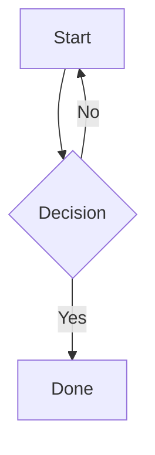

# GerdsenAI Document Builder

A professional Markdown → PDF builder with custom cover pages, Mermaid diagram rendering, language-aware code block styling, and intelligent text formatting.

---

## Quick Start

```bash
git clone https://github.com/GerdsenAI/GerdsenAI_Document_Builder.git
cd GerdsenAI_Document_Builder
python3 setup.py
```

That's it. `setup.py` automatically:
1. **Creates a virtual environment** (`venv/`) if one doesn't exist
2. **Installs all dependencies** from `requirements.txt`
3. **Launches an interactive menu** to build PDFs, install Playwright, edit settings, and more

> **Mermaid diagrams:** On first use, select option **[4]** in the menu to install Playwright + Chromium (~200MB, one-time).

### Alternative: Manual Setup

If you prefer manual control or are using the shell script directly:

```bash
python3 -m venv venv
source venv/bin/activate          # macOS/Linux  |  venv\Scripts\activate on Windows
pip install -r requirements.txt
playwright install chromium       # one-time, for Mermaid diagram support
chmod +x build_document.sh       # macOS/Linux only

./build_document.sh               # build all
./build_document.sh my_doc.md     # build one
```


PDFs are generated in the `PDFs/` directory.

---

## Customizing the Cover Page

Every generated PDF begins with a branded cover page. Customize it by editing the **YAML front matter** at the top of your Markdown file:

```yaml
---
title: "Your Document Title"
subtitle: "Optional subtitle line"
author: "Your Name"
date: "February 2026"
version: "2.1.0"
---
```

| Field | Default | What It Controls |
|-------|---------|------------------|
| `title` | `"Untitled Document"` | Large bold heading on the cover |
| `subtitle` | *(none)* | Smaller text below the title |
| `author` | `config.yaml → default.author` | "Prepared by …" line |
| `date` | Today's date | Date line near the bottom |
| `version` | `"1.0.0"` | Version line at the very bottom |

### Changing the Logo

Logos are configured in `config.yaml` under the `logos` section. Cover and footer can use the same or different images:

```yaml
logos:
  cover: "GerdsenAI_Neural_G_Invoice.png"   # displayed on cover page
  footer: "GerdsenAI_Neural_G_Invoice.png"  # displayed in page footer
```

Place your logo files (PNG, JPG, or SVG) in the `Assets/` directory. The cover logo scales to ~2.5 inches wide while preserving aspect ratio.

**Interactive setup:** Run `python3 setup.py` and select option **[9]** to pick logos from a list of available images.

### Changing Default Metadata

If you omit front matter fields, defaults come from `config.yaml`:

```yaml
default:
  author: "Your Name"
  company: "Your Company"
  version: "1.0.0"
  filename_prefix: "GerdsenAI_"   # prefix for output PDFs
```

Set `filename_prefix` to `""` to disable the prefix on generated filenames.

---

## Features

### Professional Design
- **Custom cover pages** with logo, title, subtitle, author, date, and version
- **Table of Contents** auto-generated from headings with page numbers
- **Page headers** (document title) and **footers** (logo + page number) on every page
- **Configurable margins** and page size (A4, Letter, Legal)

### Language-Aware Code Block Styling

Fenced code blocks are styled based on their language identifier:

| Language | Style | Details |
|----------|-------|---------|
| `diff` | Dark bg, blue border | Green additions, red deletions, blue hunk headers |
| `tree` / `treeview` | Dark bg, green border | Blue tree characters, gold directories |
| `bash` / `sh` / `zsh` / `shell` | Black bg, green border | Bold green prompts, teal output |
| `python`, `yaml`, etc. | Light gray bg, subtle border | Dark text, GitHub-style |
| *(no language)* | Black bg, green text | Classic terminal look |

All colors are configurable in `config.yaml` under the `code_blocks` section.

### Mermaid Diagram Rendering

Mermaid diagrams render locally via Playwright + Chromium — no internet required.

````markdown

```mermaid
flowchart TD
    A[Start] --> B{Decision}
    B -->|Yes| C[Done]
    B -->|No| A
```
````

**Supported diagram types:** Flowcharts, Sequence, Gantt, Class, State, ER, Journey, Pie, and more. See [mermaid.js.org](https://mermaid.js.org/) for full syntax.

**Rendering performance:** ~2–3s for the first diagram (Chromium startup), ~0.5s each after that.

Configure in `config.yaml`:

```yaml
mermaid:
  enabled: true
  theme: default         # default, dark, forest, neutral, base
  background: white
  viewport_width: 1200
  viewport_height: 800
  max_width_percent: 95
  fallback_to_code: true # show as code block if rendering fails
```

### Image and Screenshot Embedding

Embed images directly in your PDF using standard markdown syntax:

```markdown

```

Images are automatically:
- **Auto-numbered** with figure captions (e.g., "Figure 1: Architecture Diagram")
- **Scaled** to fit the page while preserving aspect ratio
- **Kept together** with their captions (no page break between image and caption)

**Supported formats:** PNG, JPEG, GIF, BMP, TIFF, WebP. SVG files must be converted to PNG first.

**RGBA transparency:** PNG images with alpha channels are automatically composited onto a white background.

**Path resolution:** Images are resolved from (in order): absolute path, relative to source markdown, `GERDSENAI_SOURCE_DIR` env var, current working directory.

### Intelligent Text Formatting
- **Smart justification** — long paragraphs justified, short ones left-aligned
- **Paragraphs with ≥2 inline code snippets** → left-aligned to prevent gaps
- **Blockquote styling** with blue accent border
- **Horizontal rules** — `---` renders as a styled line separator
- **Table formatting** with alternating row colors, accurate column widths via text measurement, and configurable header repetition on page breaks
- **Nested lists** up to 5 levels deep with configurable bullet characters
- **Smart page breaks** — headings are grouped with their first content paragraph to prevent orphaning; major headings (h1/h2) insert conditional page breaks
- **Hyphenation support** for even text distribution

---

## Repository Structure

```
GerdsenAI_Document_Builder/
├── To_Build/              # Place your .md files here
├── PDFs/                  # Generated PDFs
├── Assets/                # Logo and images
│   └── GerdsenAI_Neural_G_Invoice.png
├── Logs/                  # Build logs
├── SF Pro/                # Optional SF Pro font files
├── document_builder_reportlab.py  # Main builder (single file)
├── setup.py               # Interactive setup & launcher (auto-creates venv)
├── build_document.sh      # CLI build script
├── config.yaml            # All configuration
├── requirements.txt       # Python dependencies
└── README.MD              # This file
```

---

## Usage

### Build Script (macOS / Linux)

```bash
./build_document.sh                  # Build all documents
./build_document.sh my_doc.md        # Build specific file
./build_document.sh --list           # List available documents
./build_document.sh --setup          # Setup/update environment
./build_document.sh --clean          # Delete generated PDFs + logs
./build_document.sh --clean-logs     # Delete only logs
./build_document.sh --help           # Show help
```

### Python Direct (All Platforms)

```bash
python document_builder_reportlab.py --help
python document_builder_reportlab.py my_doc.md
python document_builder_reportlab.py --all
```

### Document Format

```markdown
---
title: Your Document Title
author: Your Name
date: August 22, 2025
version: 1.0.0
---

# Introduction

Your content here with **bold**, *italic*, and `inline code`.

## Code Example

```python
def hello_world():
    print("Hello, World!")
```
```

---

## Installation

### Prerequisites

- **Python 3.9+** — [python.org](https://python.org) or `brew install python@3.11`
- **Git** — for cloning the repository

### Setup

```bash
# Clone
git clone https://github.com/GerdsenAI/GerdsenAI_Document_Builder.git
cd GerdsenAI_Document_Builder

# Virtual environment
python3 -m venv venv
source venv/bin/activate          # macOS/Linux
# venv\Scripts\activate           # Windows

# Dependencies
pip install --upgrade pip
pip install -r requirements.txt

# Mermaid support (one-time, ~200MB)
playwright install chromium

# Make build script executable (macOS/Linux)
chmod +x build_document.sh
```

### Verify Installation

```bash
python -c "from mermaid_cli import render_mermaid_file_sync; print('✓ mermaid-cli ready')"
python -c "import reportlab; print('✓ reportlab ready')"
python document_builder_reportlab.py --help
```

### Windows

Use `python` instead of `python3`, and `venv\Scripts\activate` instead of `source venv/bin/activate`. The build script requires WSL or Git Bash — alternatively, use `python document_builder_reportlab.py` directly.

---

## Configuration Reference

All settings live in `config.yaml`. Key sections:

### Page & Margins

```yaml
page:
  size: "A4"            # A4, Letter, Legal, A3
  orientation: "portrait"

margins:                 # in mm
  top: 25
  right: 20
  bottom: 25
  left: 20
```

### Code Block Colors

```yaml
code_blocks:
  diff:
    background: "#1e1e2e"
    added: "#a6e3a1"
    removed: "#f38ba8"
    hunk_header: "#89b4fa"
    context: "#6c7086"
    border_color: "#89b4fa"
  treeview:
    background: "#1e1e2e"
    tree_char: "#89b4fa"
    directory: "#f9e2af"
    file: "#cdd6f4"
    border_color: "#a6e3a1"
  shell:
    background: "#000000"
    prompt: "#00ff00"
    command: "#00ff00"
    output: "#00acc1"
    border_color: "#00ff00"
  generic:
    background: "#f6f8fa"
    text: "#24292e"
    border_color: "#e1e4e8"
```

### Mermaid Diagrams

```yaml
mermaid:
  enabled: true
  theme: "default"
  background: "white"
  viewport_width: 1200
  viewport_height: 800
  max_width_percent: 95
  fallback_to_code: true
  auto_fix_edge_cases: true
```

---

## IDE Setup (VSCode / VSCodium)

1. Open the project folder — VSCode will suggest recommended extensions
2. Select the Python interpreter: `Cmd+Shift+P` → **Python: Select Interpreter** → choose `./venv/bin/python`
3. New terminals will auto-activate the virtual environment

**Recommended extensions** (auto-suggested via `.vscode/extensions.json`):
- Python + Pylance
- Black Formatter
- Markdown All in One
- Markdown Lint
- Markdown Mermaid preview

---

## Troubleshooting

| Issue | Solution |
|-------|----------|
| Virtual environment not activating | `python3 -m venv venv && source venv/bin/activate` |
| `playwright: command not found` | Activate venv first, then `pip install playwright && playwright install chromium` |
| Mermaid diagrams render poorly | Increase `viewport_width` in config.yaml |
| Diagrams too large in PDF | Decrease `max_width_percent` in config.yaml |
| Invalid Mermaid syntax | Validate at [mermaid.live](https://mermaid.live) |
| Font warnings | Safe to ignore — Helvetica is used as fallback |
| Permission denied on build script | `chmod +x build_document.sh` |
| Missing dependencies | `pip install -r requirements.txt` |

**Logs:** Check `Logs/document_builder_YYYYMMDD.log` for detailed build output.

---

## Privacy & Security

- **100% local** — all rendering happens on your machine
- **No external API calls** — Mermaid renders via local Chromium
- **Offline support** — works without internet after initial setup
- **No telemetry** — no usage tracking or analytics

---

## Dependencies

| Package | Purpose | License |
|---------|---------|---------|
| [ReportLab](https://www.reportlab.com/) ≥4.0 | PDF generation | BSD |
| [Python-Markdown](https://python-markdown.github.io/) ≥3.5 | Markdown → HTML | BSD |
| [Beautiful Soup 4](https://www.crummy.com/software/BeautifulSoup/) ≥4.12 | HTML parsing | MIT |
| [Pillow](https://pillow.readthedocs.io/) ≥10.0 | Image processing | HPND |
| [PyYAML](https://pyyaml.org/) ≥6.0 | Config & front matter parsing | MIT |
| [mermaid-cli](https://github.com/seigok/mermaid-cli-python) | Mermaid diagram rendering | MIT |
| [Playwright](https://playwright.dev/) | Chromium for Mermaid | Apache 2.0 |

---

## Changelog

See [CHANGELOG.md](CHANGELOG.md) for a detailed version history.

**Recent highlights:**
- **v2.1.1** — Title page heading/subtitle word-wrap fixes, GitHub Actions release workflow
- **v2.1.0** — Language-aware code block styling, configurable logos, interactive setup
- **v2.0.0** — Mermaid diagram rendering, table overflow fix
- **v1.0.0** — Initial release

---

## Contributing

1. Fork the repository
2. Create a feature branch
3. Follow PEP 8 for Python code
4. Test builds with `./build_document.sh` after changes
5. Submit a pull request

---

## License

MIT License — Copyright (c) 2025 GerdsenAI

See [LICENSE.txt](LICENSE.txt) for full text.

---

**Quick Start:** Place your Markdown files in `To_Build/`, run `./build_document.sh`, and find your PDFs in `PDFs/`.
